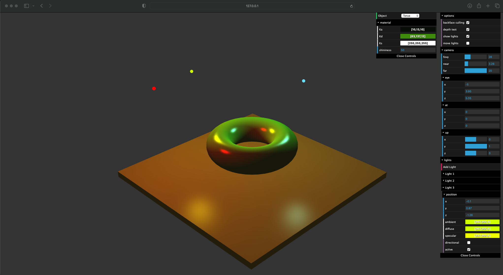
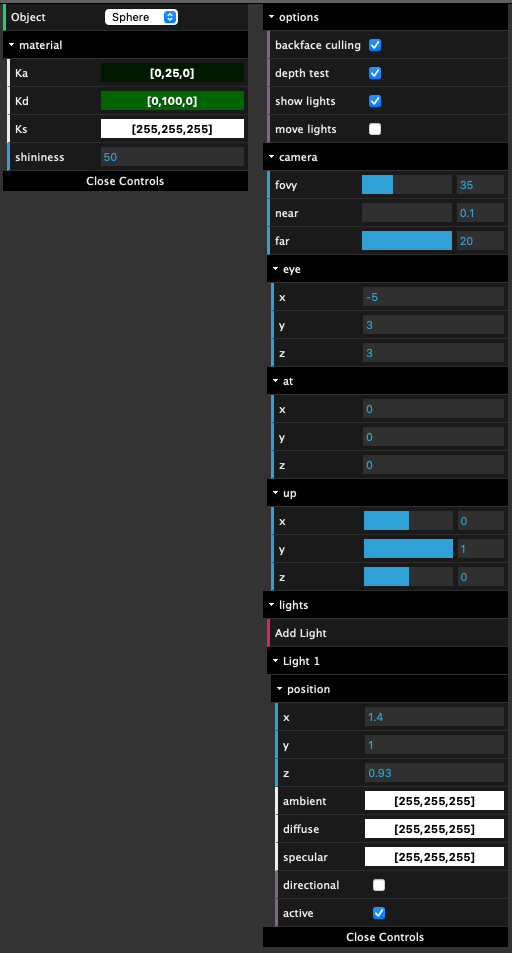

# Light Simulation
This project aims to simulate light movement and their interaction in an environment, and was done in Javascript.

## Play with it

[Click here](https://hugogspereira.github.io/light-simulation/) in order to redirect to the website!

## Options

- Different object options: Sphere, Cube, Pyramid, Cylinder and Torus;
- Change camera and perspective view;
- Add lights;
- Move lights.

## GUI - Options

